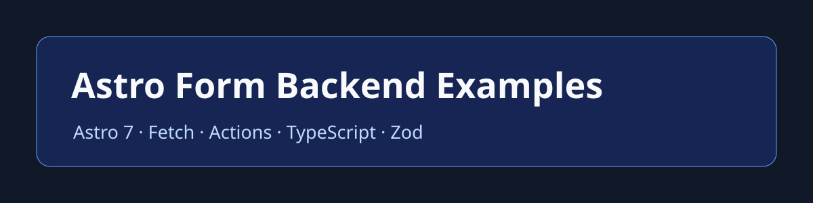

# Astro Form Backend Examples

Practical Astro 7 form examples and tutorials using native POST, Fetch, FormData, TypeScript, Astro Actions, API routes, and Zod validation. Build contact, booking, quote, registration, survey, and enquiry forms with a hosted endpoint without maintaining a separate form-processing backend.

## Quick start

1. Install dependencies with `npm install`.
2. Copy `.env.example` to `.env` and replace the endpoint placeholder.
3. Run `npm run dev`, then open the form library.

`PUBLIC_SMARTFORMIFY_ENDPOINT` is deliberately public browser configuration. Limit the endpoint to expected domains in SmartFormify; do not treat it as a secret.

## Astro form tutorials

| Example | Submission | Validation | Best for |
| --- | --- | --- | --- |
| [Native contact form](src/pages/tutorials/contact-native-post.astro) | Browser POST | HTML | Static sites |
| [Fetch form](src/pages/tutorials/fetch-form.astro) | JSON / FormData | HTML | In-page status |
| [Actions + Zod](src/pages/tutorials/actions-zod.astro) | Astro Action | Zod | Server validation |
| [API route](src/pages/tutorials/api-route.astro) | Server proxy | Server | Extra business logic |
| [Existing form](src/pages/tutorials/existing-form.astro) | Browser POST | Existing rules | Minimum-change integration |

The direct hosted endpoint is the simplest route. An Astro API route or Action is optional and is useful only when your project needs server-side logic.

## Ready-to-use Astro forms

The runnable library includes distinct templates for contact, newsletter, waitlist, demo request, client intake, project intake, contact sales, partnership inquiry, sponsorship request, feature request, webinar registration, RSVP, internship application, customer onboarding, beta signup, early access, sample request, brochure request, property viewing, membership application, service inquiry, and estimate request.

Open the home page after `npm run dev` to browse each rendered template. Existing hand-crafted examples remain available under `examples/`; password/login and unverified direct-upload examples have been removed.

## Submission patterns

Native HTML POST is ideal for static sites: the browser follows SmartFormify’s configured redirect or thank-you response. For an AJAX-style experience, submit JSON as `{ data: { ...fields } }`, inspect both the HTTP status and `success`, and then use `data.redirect_url` or `data.thank_you_content`. Use `FormData` when sending browser form fields and let the browser set its multipart boundary. Add an `Idempotency-Key` to retries or client-side Fetch submissions.

SmartFormify documents a public `/fe/YOUR_ENDPOINT_KEY` URL, a flat browser form or JSON `data` object, and a current default request-body limit of 128 KB. Direct binary file support for the endpoint is not documented here, so this project deliberately does not include a file-upload endpoint tutorial.

## Validation and security

Start with native HTML validation. Add client validation for fast feedback, or use Astro Actions and Zod when validation must run on the server. Preserve input on errors and show messages in an `aria-live` region.

Do not send passwords, payment data, API keys, authentication details, government IDs, or sensitive medical data to these examples. See [SECURITY.md](SECURITY.md) for endpoint and secret guidance.

## FAQ

### Does Astro have a built-in form backend?

Astro provides server features such as Actions and API routes, but a static Astro site needs an external processor for normal form delivery. A hosted endpoint is one option.

### Can Astro forms work on a static site?

Yes. A native HTML POST can submit directly from a fully static page, without SSR.

### Should I use Astro Actions or an API route?

Use an Action for typed form inputs and structured errors. Use an API route for a conventional HTTP endpoint or integrations. Use neither when a direct hosted POST meets the need.

### Can I submit JSON or FormData?

Yes. JSON is useful for Fetch handlers; FormData is native to HTML forms. Do not manually set a multipart boundary.

### How do I redirect after submit?

For native POST, configure the endpoint response. For Fetch, check the successful response’s `data.redirect_url` before showing `data.thank_you_content`.

## Contributing and license

See [CONTRIBUTING.md](CONTRIBUTING.md). This project is released under the [MIT License](LICENSE).

Recommended repository name: `astro-form-backend`.
